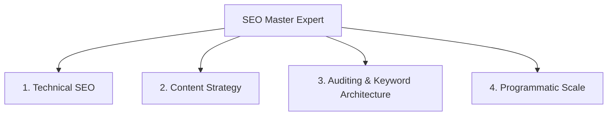

# Search Engine Optimization (SEO) Master Expert

This skill governs the entire spectrum of SEO operations, from technical compliance to content marketing, keyword architecture, page auditing, and programmatic scalability.

---

## 🎯 Use this skill when

- Designing and building web application structures or optimizing page layouts for maximum search visibility.
- Implementing semantic HTML tags, XML sitemaps, robots.txt routing, or structured schema data (Schema.org).
- Executing detailed SEO audits, resolving keyword cannibalization, or building content planning roadmaps.
- Developing template systems for dynamic, data-driven page generation at scale (Programmatic SEO).

## 🚫 Do not use this skill when

- Writing simple offline copy or working on applications that do not require external search visibility.
- Executing purely client-side system actions (like local testing or backend API routing) with no frontend rendering.

---

## 🛠️ The 4 Pillars of Modern SEO



---

### Pillar 1: Technical SEO & Core Web Vitals

Technical SEO ensures search engine crawlers can safely access, understand, and index your application.

#### A. Crawling, Indexing & Semantics
- **Robots.txt & Sitemap:** Keep paths clear. Use XML Sitemaps for fast URL discovery.
- **Canonicalization:** Always add self-referential `<link rel="canonical" href="URL">` to avoid duplicate index issues.
- **Semantic HTML:** Build pages with strict hierarchies: a single `<h1>` per page, appropriate `<section>`, `<article>`, `<nav>` elements, and descriptive `alt` text on images.
- **Structured Data:** Implement JSON-LD schemas to enable Google rich snippets:
  ```json
  {
    "@context": "https://schema.org",
    "@type": "Article",
    "headline": "Page Title",
    "author": { "@type": "Organization", "name": "ImmA" }
  }
  ```

#### B. Page Experience (Core Web Vitals)
- **LCP (Largest Contentful Paint):** Target **< 2.5s** (loading performance).
- **INP (Interaction to Next Paint):** Target **< 200ms** (responsiveness).
- **CLS (Cumulative Layout Shift):** Target **< 0.1** (visual stability).

---

### Pillar 2: Content Strategy & E-E-A-T

Google Quality Rater guidelines demand highly useful content reflecting:
- **Experience:** First-hand examples, demonstrations, and screenshots.
- **Expertise:** Deep factual accuracy, credentialed insights, and references.
- **Authoritativeness:** Clear site entity profiles and backlinks.
- **Trustworthiness:** Security (HTTPS), author transparency, and no speculative/hallucinated AI content.

---

### Pillar 3: Auditing & Keyword Architecture

When auditing existing platforms or planning new pages:
1. **Keyword Cannibalization:** Check if multiple pages target the exact same intent. If found, **merge them** using 301 redirects or consolidate details into a single master page.
2. **Snippet Hunting:** Structure headings (`h2`/`h3`) with direct questions followed by short, 40-60 word paragraph answers to capture featured snippets.
3. **Meta Optimizations:** Keep titles **under 60 characters** (descriptive + keyword) and meta descriptions **under 155 characters** (click-driving, reflecting exact user intent).

---

### Pillar 4: Programmatic SEO

To scale organic visibility dynamically using data:
- **Database Modeling:** Map dynamic entities (e.g., list of real estate properties, geographic locations, integration nodes).
- **Template System:** Build high-performance page templates dynamically rendering metadata, unique headings, and dynamic lists.
- **Prevent Thin Content:** Ensure each dynamic page includes unique, contextual information (e.g., local statistics, custom maps, or dynamic data tables). Never generate pages with identical text blocks.
