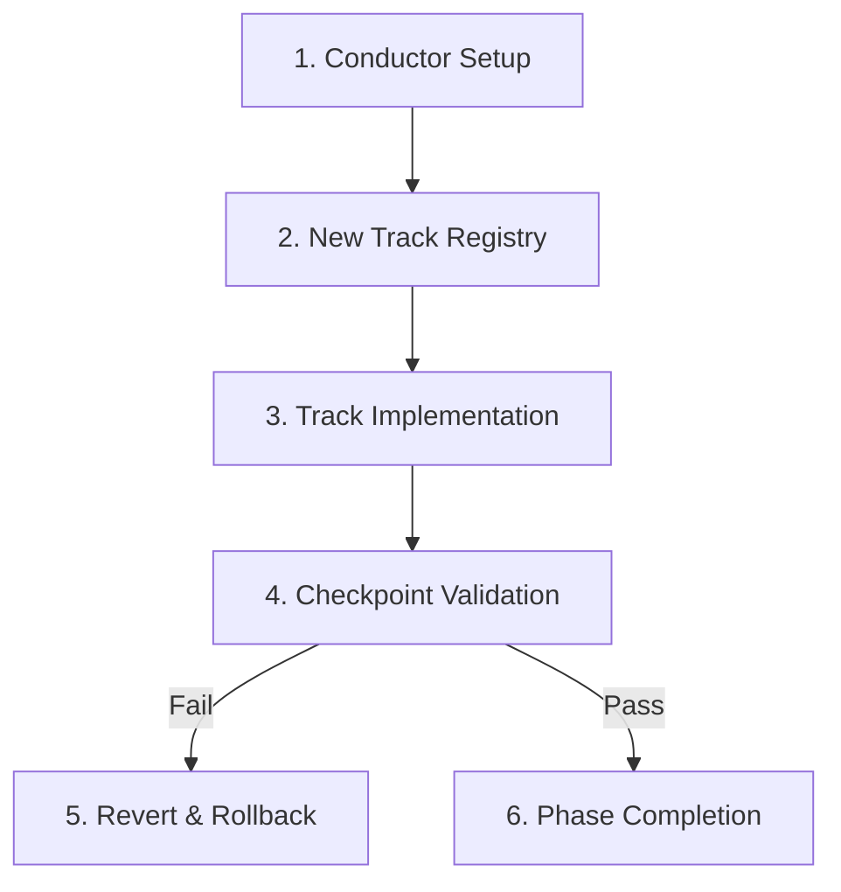

# Conductor Project Lifecycle Orchestrator

This skill governs the complete initialization, development flow, checkpoint validation, and rollback operations of a project orchestrated under the **Conductor** standard.

---

## 🎯 Use this skill when

- Initializing or resuming a project with Conductor configurations and state structures.
- Generating new developer feature tracks (`/conductor:new-track`) or updating execution tracks.
- Verifying progress and code-level checkpoints against product guidelines.
- Managing rollbacks or stage reverts (`/conductor:revert`) when integration issues arise.

## 🚫 Do not use this skill when

- Executing generic infrastructure actions (like raw Docker or GCP deployments) outside Conductor-managed projects.
- Writing feature logic that is completely independent of the Conductor track lifecycle.

---

## 🏗️ Conductor Lifecycle Phases



---

### Phase 1: Project Initialization (Setup)
Before creating developer tracks, build the project's foundation:
1. **Directory Structure:** Ensure a `/conductor` folder exists in the repository root.
2. **Q&A Protocol:** Ask **one question per turn** to define the product target, guidelines (tone, voice), tech stack (detected dynamically via package configs), and workflow rules (TDD strictness, commit patterns).
3. **State File:** Initialize `conductor/setup_state.json`:
   ```json
   {
     "status": "in_progress",
     "project_type": "greenfield|brownfield",
     "current_section": "product|guidelines|tech_stack|workflow",
     "files_created": [],
     "started_at": "ISO_TIMESTAMP"
   }
   ```
4. **Generate Base Artifacts:** Write `index.md`, `product.md`, `product-guidelines.md`, `tech-stack.md`, `workflow.md`, and `tracks.md` under `/conductor`.

---

### Phase 2: Feature Track Management
When initiating a new feature or change:
- **Registry:** Add a new track entry to `conductor/tracks.md`.
- **Track Artifact:** Create a `conductor/tracks/TRK-XXX-<name>.md` detailing:
  - Track Objectives and Constraints.
  - Task Checklist (Verb-first, bite-sized tasks, 2-5 minutes granularity).
  - Explicit test command for validation.

---

### Phase 3: Checkpoint Validation & Status Reporting
Ensure all work meets safety standards before completing:
1. **Static Analysis:** Scan modified modules for formatting, linting errors, or test breaks.
2. **Dynamic Tests:** Execute the specific test command detailed in the track file.
3. **Interactive Reporting:** Run status reporting protocols to update `tracks.md` status fields (`pending`, `in_progress`, `completed`).

---

### Phase 4: Stage Reversion & Rollbacks
If a task or track causes regression or fails integration validation:
1. **Target Identification:** Read the specific git commit hash or file state linked to the track.
2. **Git Reversion:** Safely checkout the previous stable branch state or run git revert commands.
3. **State Rollback:** Update `conductor/tracks.md` and `setup_state.json`, marking the track status as `reverted` or `pending_fix`. Log the issue details in a recovery notebook or incident report.
